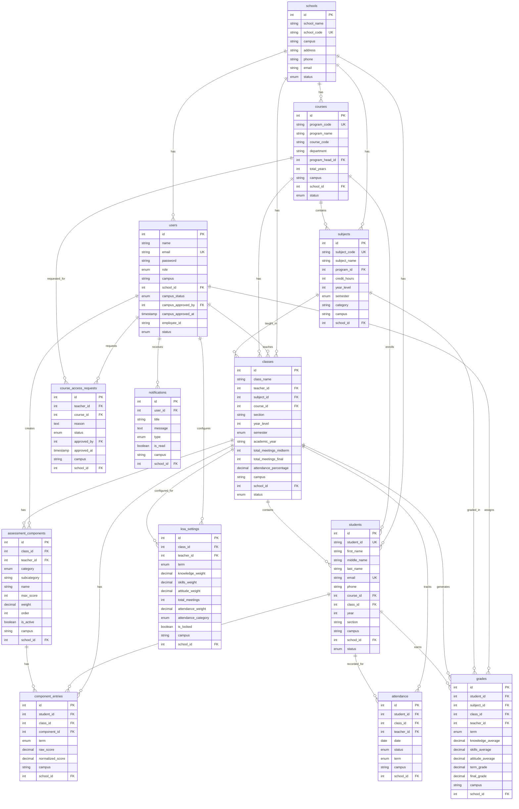

# Database Entity Relationship Diagram (ERD)
## EduTrack System - Complete Database Architecture

**Generated:** March 22, 2026  
**Database:** MySQL  
**Total Tables:** 40+  
**Core Entities:** 13

---

## Table of Contents
1. [Overview](#overview)
2. [Core Entities](#core-entities)
3. [Entity Relationships](#entity-relationships)
4. [Detailed Table Structures](#detailed-table-structures)
5. [Mermaid ERD Diagram](#mermaid-erd-diagram)
6. [Data Flow Diagrams](#data-flow-diagrams)

---

## Overview

The EduTrack system is a comprehensive educational management platform with the following key features:
- Multi-campus support with data isolation
- Role-based access control (Super Admin, Admin, Teacher, Student)
- Advanced grading system with KSA (Knowledge, Skills, Attitude) framework
- Attendance tracking and management
- Course and subject management
- Dynamic grade components and calculations

---

## Core Entities

### 1. User Management
- **users** - Central authentication and user profiles
- **schools** - School/Campus definitions

### 2. Academic Structure
- **courses** - Academic programs (BSIT, BSA, etc.)
- **subjects** - Subject catalog
- **classes** - Class sections/schedules

### 3. People
- **students** - Student records (separated from users)
- **teachers** - Managed through users table with role='teacher'

### 4. Grading System
- **assessment_components** - Dynamic grade components
- **component_entries** - Individual grade entries
- **ksa_settings** - KSA percentage configuration
- **grades** - Final computed grades

### 5. Attendance
- **attendance** - Attendance records

### 6. System
- **course_access_requests** - Teacher course access requests
- **notifications** - System notifications

---


## Entity Relationships

### Primary Relationships

```
schools (1) ----< (M) users
schools (1) ----< (M) courses
schools (1) ----< (M) subjects
schools (1) ----< (M) classes
schools (1) ----< (M) students

users (1) ----< (M) classes [as teacher]
users (1) ----< (M) assessment_components [as teacher]
users (1) ----< (M) ksa_settings [as teacher]
users (1) ----< (M) course_access_requests [as teacher]
users (1) ----< (M) notifications

courses (1) ----< (M) subjects
courses (1) ----< (M) classes
courses (1) ----< (M) students
courses (1) ----< (M) course_access_requests

subjects (1) ----< (M) classes
subjects (1) ----< (M) grades

classes (1) ----< (M) students
classes (1) ----< (M) assessment_components
classes (1) ----< (M) component_entries
classes (1) ----< (M) ksa_settings
classes (1) ----< (M) attendance
classes (1) ----< (M) grades

students (1) ----< (M) component_entries
students (1) ----< (M) attendance
students (1) ----< (M) grades

assessment_components (1) ----< (M) component_entries
```

### Relationship Types

**One-to-Many (1:M)**
- School → Users, Courses, Subjects, Classes, Students
- Course → Subjects, Classes, Students
- Class → Students, Grades, Attendance, Components
- Teacher (User) → Classes, Components, Settings

**Many-to-Many (M:N)**
- Teachers ↔ Subjects (via teacher_subject pivot)
- Classes ↔ Students (via class_students pivot - optional)

---


## Detailed Table Structures

### 1. users (Central Authentication)
**Purpose:** Manages all user accounts (admins, teachers, students)

| Column | Type | Description |
|--------|------|-------------|
| id | INT PK | Primary key |
| name | VARCHAR | Full name |
| email | VARCHAR UNIQUE | Email address |
| password | VARCHAR | Hashed password |
| role | ENUM | admin, teacher, student, super |
| campus | VARCHAR NULL | Campus affiliation |
| school_id | INT FK NULL | School reference |
| campus_status | ENUM NULL | approved, pending, rejected |
| campus_approved_by | INT FK NULL | Approver user_id |
| campus_approved_at | TIMESTAMP NULL | Approval timestamp |
| employee_id | VARCHAR NULL | Employee ID (teachers) |
| status | ENUM | Active, Inactive |
| created_at | TIMESTAMP | Creation timestamp |
| updated_at | TIMESTAMP | Update timestamp |

**Relationships:**
- belongs to: schools (school_id)
- has many: classes (as teacher)
- has many: assessment_components (as teacher)
- has many: notifications

---

### 2. schools (Campus Management)
**Purpose:** Defines schools/campuses in the system

| Column | Type | Description |
|--------|------|-------------|
| id | INT PK | Primary key |
| school_name | VARCHAR | School name |
| school_code | VARCHAR UNIQUE | School code |
| campus | VARCHAR | Campus name |
| address | TEXT NULL | Physical address |
| phone | VARCHAR NULL | Contact phone |
| email | VARCHAR NULL | Contact email |
| principal_name | VARCHAR NULL | Principal name |
| status | ENUM | Active, Inactive |
| created_at | TIMESTAMP | Creation timestamp |
| updated_at | TIMESTAMP | Update timestamp |

**Relationships:**
- has many: users
- has many: courses
- has many: subjects
- has many: classes
- has many: students

---

### 3. courses (Academic Programs)
**Purpose:** Defines academic programs/degrees

| Column | Type | Description |
|--------|------|-------------|
| id | INT PK | Primary key |
| program_code | VARCHAR UNIQUE | Program code (e.g., BSIT) |
| program_name | VARCHAR | Program name |
| course_code | VARCHAR | Course code |
| department | VARCHAR | Department name |
| program_head_id | INT FK NULL | Program head (teacher) |
| total_years | INT | Duration in years |
| description | TEXT NULL | Program description |
| campus | VARCHAR NULL | Campus affiliation |
| school_id | INT FK NULL | School reference |
| status | ENUM | Active, Inactive |
| created_at | TIMESTAMP | Creation timestamp |
| updated_at | TIMESTAMP | Update timestamp |

**Relationships:**
- belongs to: schools (school_id)
- belongs to: users (program_head_id)
- has many: subjects
- has many: classes
- has many: students

---

### 4. subjects (Subject Catalog)
**Purpose:** Defines subjects/courses offered

| Column | Type | Description |
|--------|------|-------------|
| id | INT PK | Primary key |
| subject_code | VARCHAR UNIQUE | Subject code |
| subject_name | VARCHAR | Subject name |
| program_id | INT FK NULL | Parent program |
| credit_hours | INT | Credit hours |
| year_level | INT | Year level (1-4) |
| semester | ENUM | 1, 2 |
| category | VARCHAR | Subject category |
| description | TEXT NULL | Subject description |
| campus | VARCHAR NULL | Campus affiliation |
| school_id | INT FK NULL | School reference |
| campus_code | VARCHAR NULL | Campus-specific code |
| created_at | TIMESTAMP | Creation timestamp |
| updated_at | TIMESTAMP | Update timestamp |

**Relationships:**
- belongs to: courses (program_id)
- belongs to: schools (school_id)
- has many: classes
- has many: grades
- many to many: users (teachers via teacher_subject)

---


### 5. classes (Class Sections)
**Purpose:** Defines class sections/schedules

| Column | Type | Description |
|--------|------|-------------|
| id | INT PK | Primary key |
| class_name | VARCHAR | Class name |
| teacher_id | INT FK NULL | Assigned teacher |
| subject_id | INT FK NULL | Subject taught |
| course_id | INT FK NULL | Parent course |
| section | VARCHAR | Section identifier |
| year_level | INT | Year level |
| semester | ENUM | 1, 2 |
| academic_year | VARCHAR | Academic year |
| schedule | VARCHAR NULL | Class schedule |
| room | VARCHAR NULL | Room number |
| total_meetings_midterm | INT | Midterm meetings |
| total_meetings_final | INT | Final meetings |
| attendance_percentage | DECIMAL | Attendance weight % |
| campus | VARCHAR NULL | Campus affiliation |
| school_id | INT FK NULL | School reference |
| status | ENUM | Active, Inactive |
| created_at | TIMESTAMP | Creation timestamp |
| updated_at | TIMESTAMP | Update timestamp |

**Relationships:**
- belongs to: users (teacher_id)
- belongs to: subjects (subject_id)
- belongs to: courses (course_id)
- belongs to: schools (school_id)
- has many: students
- has many: assessment_components
- has many: component_entries
- has many: ksa_settings
- has many: attendance
- has many: grades

---

### 6. students (Student Records)
**Purpose:** Stores student information (separated from users)

| Column | Type | Description |
|--------|------|-------------|
| id | INT PK | Primary key |
| student_id | VARCHAR UNIQUE | Student ID number |
| first_name | VARCHAR | First name |
| middle_name | VARCHAR NULL | Middle name |
| last_name | VARCHAR | Last name |
| suffix | VARCHAR NULL | Name suffix |
| email | VARCHAR UNIQUE | Email address |
| phone | VARCHAR NULL | Phone number |
| address | TEXT NULL | Physical address |
| course_id | INT FK NULL | Enrolled course |
| class_id | INT FK NULL | Assigned class |
| year | INT | Year level |
| section | VARCHAR NULL | Section |
| campus | VARCHAR NULL | Campus affiliation |
| school_id | INT FK NULL | School reference |
| status | ENUM | Active, Inactive |
| created_at | TIMESTAMP | Creation timestamp |
| updated_at | TIMESTAMP | Update timestamp |

**Relationships:**
- belongs to: courses (course_id)
- belongs to: classes (class_id)
- belongs to: schools (school_id)
- has many: component_entries
- has many: attendance
- has many: grades

---

### 7. assessment_components (Grade Components)
**Purpose:** Defines dynamic grade components (quizzes, exams, etc.)

| Column | Type | Description |
|--------|------|-------------|
| id | INT PK | Primary key |
| class_id | INT FK | Parent class |
| teacher_id | INT FK | Component creator |
| category | ENUM | Knowledge, Skills, Attitude |
| subcategory | VARCHAR | Quiz, Exam, Output, etc. |
| name | VARCHAR | Component name |
| max_score | INT | Maximum score |
| weight | DECIMAL | Weight percentage |
| order | INT | Display order |
| is_active | BOOLEAN | Active status |
| campus | VARCHAR NULL | Campus affiliation |
| school_id | INT FK NULL | School reference |
| created_at | TIMESTAMP | Creation timestamp |
| updated_at | TIMESTAMP | Update timestamp |

**Relationships:**
- belongs to: classes (class_id)
- belongs to: users (teacher_id)
- belongs to: schools (school_id)
- has many: component_entries

---


### 8. component_entries (Grade Entries)
**Purpose:** Stores individual grade entries for students

| Column | Type | Description |
|--------|------|-------------|
| id | INT PK | Primary key |
| student_id | INT FK | Student reference |
| class_id | INT FK | Class reference |
| component_id | INT FK | Component reference |
| term | ENUM | midterm, final |
| raw_score | DECIMAL | Raw score entered |
| normalized_score | DECIMAL | Normalized score (50-100) |
| remarks | TEXT NULL | Additional remarks |
| campus | VARCHAR NULL | Campus affiliation |
| school_id | INT FK NULL | School reference |
| created_at | TIMESTAMP | Creation timestamp |
| updated_at | TIMESTAMP | Update timestamp |

**Unique Constraint:** (student_id, component_id, term)

**Relationships:**
- belongs to: students (student_id)
- belongs to: classes (class_id)
- belongs to: assessment_components (component_id)
- belongs to: schools (school_id)

**Normalization Formula:** `(raw_score / max_score) × 50 + 50`

---

### 9. ksa_settings (KSA Configuration)
**Purpose:** Stores KSA percentage distribution per class/term

| Column | Type | Description |
|--------|------|-------------|
| id | INT PK | Primary key |
| class_id | INT FK | Class reference |
| teacher_id | INT FK | Teacher reference |
| term | ENUM | midterm, final |
| knowledge_weight | DECIMAL | Knowledge % (default 40) |
| skills_weight | DECIMAL | Skills % (default 50) |
| attitude_weight | DECIMAL | Attitude % (default 10) |
| total_meetings | INT NULL | Total class meetings |
| attendance_weight | DECIMAL NULL | Attendance weight % |
| attendance_category | ENUM NULL | knowledge, skills, attitude |
| is_locked | BOOLEAN | Lock status |
| campus | VARCHAR NULL | Campus affiliation |
| school_id | INT FK NULL | School reference |
| created_at | TIMESTAMP | Creation timestamp |
| updated_at | TIMESTAMP | Update timestamp |

**Constraint:** knowledge_weight + skills_weight + attitude_weight = 100

**Relationships:**
- belongs to: classes (class_id)
- belongs to: users (teacher_id)
- belongs to: schools (school_id)

---

### 10. attendance (Attendance Records)
**Purpose:** Tracks student attendance

| Column | Type | Description |
|--------|------|-------------|
| id | INT PK | Primary key |
| student_id | INT FK | Student reference |
| class_id | INT FK | Class reference |
| teacher_id | INT FK NULL | Teacher reference |
| date | DATE | Attendance date |
| status | ENUM | Present, Absent, Late, Leave |
| term | ENUM | Midterm, Final |
| notes | TEXT NULL | Additional notes |
| campus | VARCHAR NULL | Campus affiliation |
| school_id | INT FK NULL | School reference |
| created_at | TIMESTAMP | Creation timestamp |
| updated_at | TIMESTAMP | Update timestamp |

**Relationships:**
- belongs to: students (student_id)
- belongs to: classes (class_id)
- belongs to: users (teacher_id)
- belongs to: schools (school_id)

**Attendance Score Formula:** `(attendance_count / total_meetings) × 50 + 50`

---


### 11. grades (Final Grades)
**Purpose:** Stores computed final grades

| Column | Type | Description |
|--------|------|-------------|
| id | INT PK | Primary key |
| student_id | INT FK | Student reference |
| subject_id | INT FK NULL | Subject reference |
| class_id | INT FK NULL | Class reference |
| teacher_id | INT FK NULL | Teacher reference |
| term | ENUM | midterm, final |
| knowledge_average | DECIMAL | Knowledge category avg |
| skills_average | DECIMAL | Skills category avg |
| attitude_average | DECIMAL | Attitude category avg |
| term_grade | DECIMAL | Computed term grade |
| final_grade | DECIMAL | Final grade |
| remarks | VARCHAR NULL | Pass/Fail remarks |
| campus | VARCHAR NULL | Campus affiliation |
| school_id | INT FK NULL | School reference |
| created_at | TIMESTAMP | Creation timestamp |
| updated_at | TIMESTAMP | Update timestamp |

**Relationships:**
- belongs to: students (student_id)
- belongs to: subjects (subject_id)
- belongs to: classes (class_id)
- belongs to: users (teacher_id)
- belongs to: schools (school_id)

**Grade Calculation:**
```
term_grade = (knowledge_avg × K%) + (skills_avg × S%) + (attitude_avg × A%)
where K%, S%, A% are from ksa_settings
```

---

### 12. course_access_requests (Access Requests)
**Purpose:** Manages teacher course access requests

| Column | Type | Description |
|--------|------|-------------|
| id | INT PK | Primary key |
| teacher_id | INT FK | Requesting teacher |
| course_id | INT FK | Requested course |
| reason | TEXT | Request reason |
| status | ENUM | pending, approved, rejected |
| approved_by | INT FK NULL | Approver user_id |
| approved_at | TIMESTAMP NULL | Approval timestamp |
| admin_note | TEXT NULL | Admin notes |
| campus | VARCHAR NULL | Campus affiliation |
| school_id | INT FK NULL | School reference |
| created_at | TIMESTAMP | Creation timestamp |
| updated_at | TIMESTAMP | Update timestamp |

**Relationships:**
- belongs to: users (teacher_id)
- belongs to: courses (course_id)
- belongs to: users (approved_by)
- belongs to: schools (school_id)

---

### 13. notifications (System Notifications)
**Purpose:** Stores system notifications for users

| Column | Type | Description |
|--------|------|-------------|
| id | INT PK | Primary key |
| user_id | INT FK | Target user |
| title | VARCHAR | Notification title |
| message | TEXT | Notification message |
| type | ENUM | info, success, warning, error |
| icon | VARCHAR NULL | Icon identifier |
| action_url | VARCHAR NULL | Action URL |
| is_read | BOOLEAN | Read status |
| campus | VARCHAR NULL | Campus affiliation |
| school_id | INT FK NULL | School reference |
| created_at | TIMESTAMP | Creation timestamp |
| updated_at | TIMESTAMP | Update timestamp |

**Relationships:**
- belongs to: users (user_id)
- belongs to: schools (school_id)

---


## Mermaid ERD Diagram

### Complete System ERD



---


## Data Flow Diagrams

### 1. Student Enrollment Flow

```
Admin/Teacher
    ↓
Creates Student Record
    ↓
students table
    ├→ Assigns to Course (course_id)
    └→ Assigns to Class (class_id)
        ↓
    Student can now:
        ├→ Receive Grades (component_entries)
        ├→ Have Attendance Tracked (attendance)
        └→ Earn Final Grades (grades)
```

### 2. Grade Entry Flow

```
Teacher
    ↓
Configures KSA Settings (ksa_settings)
    ├→ Knowledge: 40%
    ├→ Skills: 50%
    └→ Attitude: 10%
    ↓
Creates Assessment Components (assessment_components)
    ├→ Knowledge: Exams, Quizzes
    ├→ Skills: Outputs, Activities
    └→ Attitude: Behavior, Attendance
    ↓
Enters Grades (component_entries)
    ├→ Raw Score (e.g., 85/100)
    └→ Normalized Score: (85/100) × 50 + 50 = 92.5
    ↓
System Calculates Category Averages
    ├→ Knowledge Avg = Weighted avg of exams & quizzes
    ├→ Skills Avg = Weighted avg of outputs & activities
    └→ Attitude Avg = Weighted avg of behavior & attendance
    ↓
System Computes Final Grade (grades)
    Final = (K_avg × 40%) + (S_avg × 50%) + (A_avg × 10%)
```

### 3. Attendance Integration Flow

```
Teacher
    ↓
Configures Attendance Settings (ksa_settings)
    ├→ Total Meetings: 17
    ├→ Attendance Weight: 10%
    └→ Attendance Category: Attitude
    ↓
Records Attendance (attendance)
    ├→ Present: Counts as attended
    ├→ Late: Counts as attended
    ├→ Absent: Does not count
    └→ Leave: Does not count
    ↓
System Calculates Attendance Score
    Formula: (attendance_count / total_meetings) × 50 + 50
    Example: (5/17) × 50 + 50 = 64.71
    ↓
Attendance Score Affects Selected Category
    If category = Attitude:
        Attitude Avg includes attendance score
    ↓
Final Grade Calculation
    Includes attendance impact via category average
```

### 4. Campus Isolation Flow

```
User Login
    ↓
System Checks User Role & Campus
    ├→ Super Admin: No campus restriction
    ├→ Campus Admin: campus = "Kabankalan"
    └→ Teacher: campus = "Kabankalan"
    ↓
All Queries Filtered by Campus
    ├→ students WHERE campus = "Kabankalan"
    ├→ classes WHERE campus = "Kabankalan"
    ├→ courses WHERE campus = "Kabankalan"
    └→ All related data filtered
    ↓
Data Isolation Enforced
    User can only see/modify their campus data
```

### 5. Teacher Approval Flow

```
Teacher Registers
    ↓
users table created
    ├→ role = "teacher"
    ├→ campus = "Kabankalan"
    ├→ campus_status = "pending"
    └→ school_id = 71
    ↓
Admin Reviews (admin.teachers.campus-approvals)
    ↓
Admin Decision
    ├→ Approve
    │   ├→ campus_status = "approved"
    │   ├→ campus_approved_by = admin_id
    │   ├→ campus_approved_at = now()
    │   └→ Teacher can now create classes
    │
    └→ Reject
        ├→ campus_status = "rejected"
        ├→ rejection_reason = "..."
        └→ Teacher cannot create classes
```

---


## Key Design Patterns

### 1. Campus Isolation Pattern
**Purpose:** Ensure data privacy between campuses

**Implementation:**
- Every major table has `campus` and `school_id` columns
- All queries filtered by user's campus
- Campus admins see only their campus data
- Super admins see all data

**Tables with Campus Isolation:**
- users, students, classes, courses, subjects
- assessment_components, component_entries
- ksa_settings, attendance, grades
- notifications, course_access_requests

### 2. Soft Delete Pattern
**Purpose:** Maintain data integrity and audit trail

**Implementation:**
- `status` column (Active/Inactive) instead of hard deletes
- Allows data recovery
- Maintains referential integrity
- Enables historical reporting

**Tables with Soft Delete:**
- users, students, classes, courses, subjects

### 3. Approval Workflow Pattern
**Purpose:** Control access and permissions

**Implementation:**
- `status` column (pending/approved/rejected)
- `approved_by` and `approved_at` columns
- Tracks approval history
- Enables admin oversight

**Tables with Approval:**
- users (campus_status, campus_approved_by, campus_approved_at)
- course_access_requests (status, approved_by, approved_at)

### 4. Flexible Grading Pattern
**Purpose:** Support dynamic grade components

**Implementation:**
- assessment_components: Define any number of components
- component_entries: Store individual scores
- ksa_settings: Configure category weights
- Normalization formula: (raw/max) × 50 + 50

**Benefits:**
- Teachers can customize grading schemes
- Supports different assessment types
- Automatic calculation
- Historical tracking

### 5. Pivot Table Pattern
**Purpose:** Many-to-many relationships

**Implementation:**
- teacher_subject: Teachers ↔ Subjects
- class_students: Classes ↔ Students (optional)

**Columns:**
- Foreign keys to both tables
- Additional metadata (status, assigned_at)
- Timestamps

---

## Database Constraints

### Primary Keys
- All tables have auto-incrementing `id` as primary key
- Ensures unique identification

### Foreign Keys
- Enforced referential integrity
- Cascade rules defined where appropriate
- NULL allowed for optional relationships

### Unique Constraints
- users.email
- students.student_id
- students.email
- courses.program_code
- subjects.subject_code
- schools.school_code

### Check Constraints
- KSA percentages sum to 100
- Scores within valid ranges (0-100)
- Status enums enforced
- Date validations

### Indexes
- Primary keys (automatic)
- Foreign keys (for join performance)
- campus columns (for filtering)
- status columns (for filtering)
- Composite indexes on frequently queried combinations

---

## Performance Considerations

### Query Optimization
1. **Eager Loading:** Use `with()` to load relationships
2. **Pagination:** Limit results to 20-50 per page
3. **Caching:** Cache dashboard stats (5-10 minutes)
4. **Indexes:** On foreign keys and filter columns

### Data Volume Estimates
- **Users:** ~1,000-10,000
- **Students:** ~10,000-100,000
- **Classes:** ~1,000-10,000
- **Component Entries:** ~1,000,000+ (high volume)
- **Attendance:** ~1,000,000+ (high volume)
- **Grades:** ~100,000-1,000,000

### Scaling Strategies
1. **Partitioning:** By campus or academic year
2. **Archiving:** Move old data to archive tables
3. **Read Replicas:** For reporting queries
4. **Caching:** Redis for frequently accessed data

---

## Security Considerations

### Data Privacy
- Campus isolation enforced at query level
- Role-based access control (RBAC)
- No cross-campus data leakage
- Audit trails for sensitive operations

### Authentication
- Password hashing (bcrypt)
- Session management
- CSRF protection
- Rate limiting on login

### Authorization
- Middleware checks on all routes
- Campus verification on data access
- Teacher can only modify own classes
- Admin can only manage own campus

### Data Validation
- Input validation on all forms
- SQL injection prevention (Eloquent ORM)
- XSS protection (Blade templating)
- Mass assignment protection

---

## Maintenance & Backup

### Regular Maintenance
1. **Daily:** Database backups
2. **Weekly:** Index optimization
3. **Monthly:** Data cleanup (old notifications, logs)
4. **Quarterly:** Performance review

### Backup Strategy
- **Full Backup:** Daily at midnight
- **Incremental:** Every 6 hours
- **Retention:** 30 days online, 1 year archive
- **Testing:** Monthly restore tests

### Migration Strategy
- Version controlled migrations
- Rollback capability
- Test on staging first
- Backup before migration

---

## Future Enhancements

### Planned Features
1. **Student Portal:** Self-service grade viewing
2. **Parent Portal:** View child's progress
3. **Mobile App:** iOS/Android support
4. **Analytics Dashboard:** Advanced reporting
5. **API Integration:** Third-party integrations

### Database Changes
1. **Add Tables:**
   - parent_student (parent portal)
   - announcements (campus-wide announcements)
   - assignments (homework tracking)
   - exams (exam scheduling)

2. **Add Columns:**
   - users.last_login_at
   - students.parent_email
   - classes.max_capacity
   - grades.grade_point (GPA calculation)

3. **Performance:**
   - Add materialized views for reporting
   - Implement full-text search
   - Add database triggers for auto-calculations

---

## Conclusion

The EduTrack database is designed with:
- ✓ **Scalability:** Supports multiple campuses and thousands of users
- ✓ **Flexibility:** Dynamic grading system adaptable to different needs
- ✓ **Security:** Campus isolation and role-based access control
- ✓ **Performance:** Optimized queries and caching strategies
- ✓ **Maintainability:** Clear structure and comprehensive documentation

**Total Tables:** 40+  
**Core Entities:** 13  
**Relationships:** 50+  
**Status:** Production Ready ✓

---

**Document Version:** 1.0  
**Last Updated:** March 22, 2026  
**Maintained By:** Development Team
